# no more async

<!-- This file renders the article. The network-timing marker inserts the animation; the text after the colon is its caption. -->

I’ve been moving async out of the important parts of my code. For a network
request, that means the code tracking what was sent, whether a reply arrived,
and when to retry. I want it to handle one message completely before taking the
next.

<!-- network-timing: The order of events is part of the input. -->

The request logic puts a message like `send request 7` in an outgoing queue.
A network worker picks it up, sends the request, and puts `reply for request 7`
in a queue going back. The request logic reads that message and updates the
request’s status.

That’s a producer/consumer model. The queues hold messages in memory.
The network worker can still use async, but it never changes the request
logic’s state directly.



[Sans I/O](https://sans-io.readthedocs.io/how-to-sans-io.html) applies this
separation to protocol code. The state stays in a Rust struct. Its methods
finish processing one input before the caller gives it another.

For example, this is the retry check for a pending request. `now` is supplied
by the caller:

```rust
fn tick(&mut self, now: Duration) -> Option<Action> {
    if now < self.retry_at {
        return None;
    }

    self.retry_at = now + self.retry_interval;
    Some(Action::Send { request_id: self.id })
}
```

`tick` returns an instruction to send. The code that calls it puts that instruction
in the outgoing queue. The network worker picks it up, finds the request’s bytes
in a buffer pool, and sends them.

If `retry_at` is ten seconds, a test can pass ten seconds as `now` and check for
a `Send` action. It needs neither a live network nor a real ten-second wait.
We control the time value the logic reads; the CPU still executes the code normally.

Workers can still race to enqueue messages. To replay a failure, I need the same
starting state, message contents and order, time inputs, and random choices.

For testing, I can replace the network worker with a simulator that supplies
messages and time.



The simulator can leave request 7 unanswered until the retry deadline, or deliver
a reply just before it. Both runs use the real request logic. The simulator
advances its clock to the next scheduled event and supplies that event and time
to the request logic, without waiting for real time to pass.

A fuzzer can generate different event sequences and check a rule like “never
retry a completed request.” Any sequence that breaks the rule becomes a saved
test case.

Writing more code with agents has made this useful to me. I can give an agent
that test case and let it rerun the same failure after a change. I can also
change an event or its timing to check the explanation it gives me.
